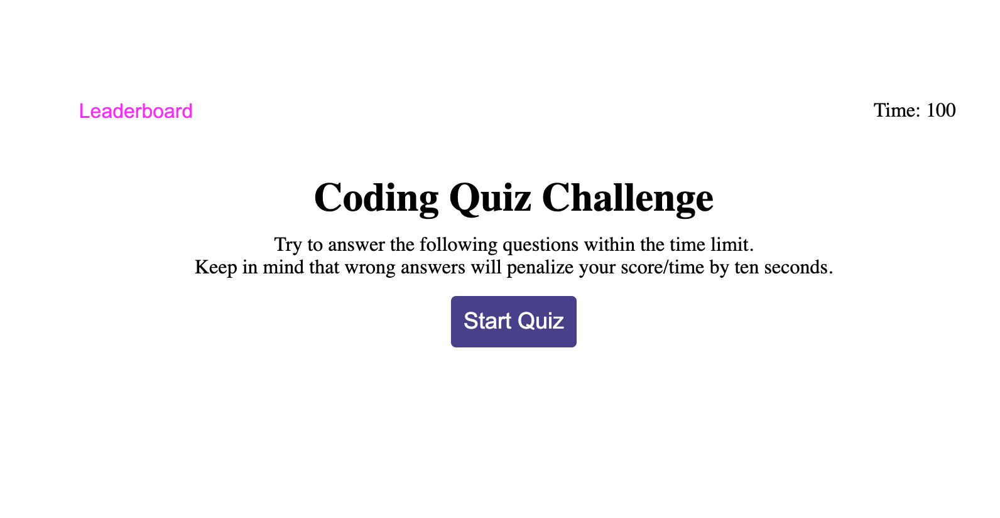
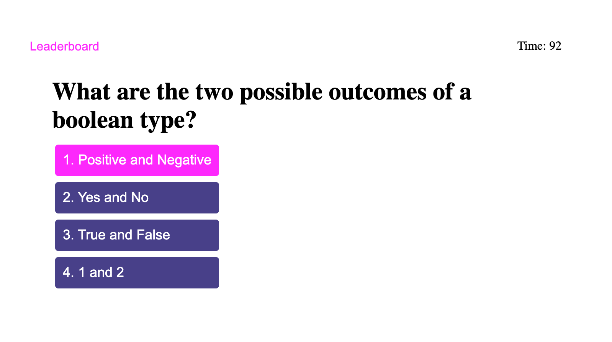
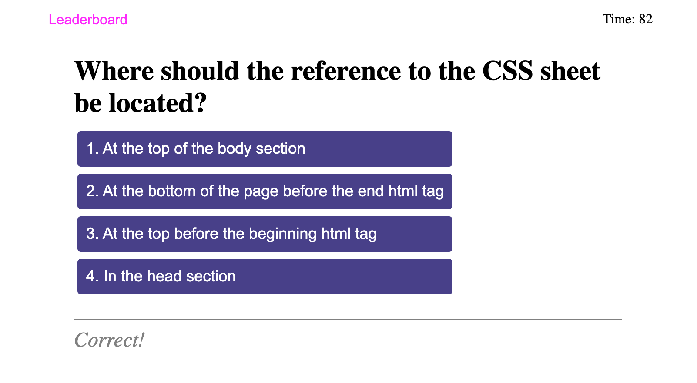
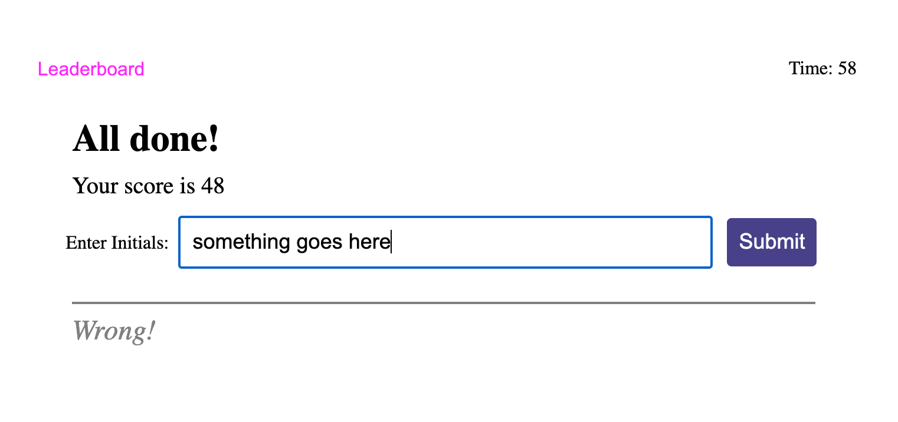
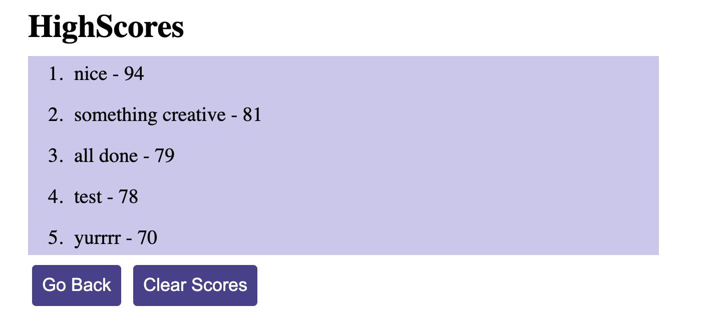

# Password Generator README
 Deployed URL : https://adambedingfield.github.io/javascript-quiz/   
 
 Github Repo URL : https://github.com/adambedingfield/javascript-quiz

 # About
Javascript Quiz is a quick 5 question quiz on CSS, HTML, and Javascript. Users are timed, answering incorrectly will subtract 10 seconds from the timer and the score of the quiz is based on the time remaining. Scores are then added to a leaderboard which is saved locally.

Layout

# Features
Clicking on the start button will enable the timer and present the first question.

Depending on the users answers a right or wrong text display will appear.

When finished with the quiz, the users score will be displayed and they will be prompted to enter a name for their score.

When they submit they will be taken to the scoreboard where their new score and any other previous scores will be displayed. The leaderboard can also be jumped to from anywhere by clicking on the pink leaderboard text.

The leaderboard can be cleared removing any previous scores.

# Languages used
HTML, CSS, and Javascript.  
Bulk of the code is written in JS.